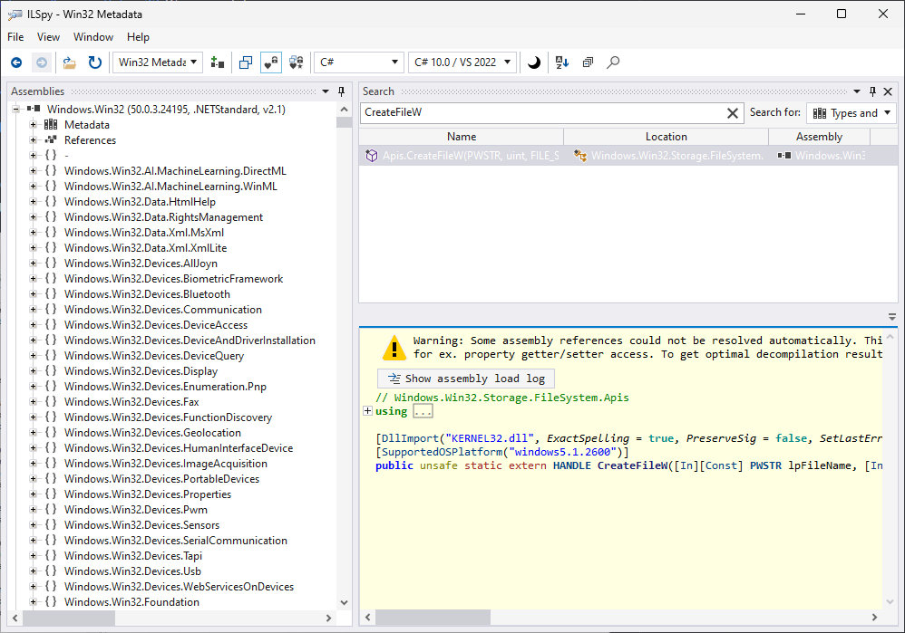

# Overview

Win32 APIs provide functionality that not all languages and frameworks support themselves. When developing for Windows, developers often call into Win32 APIs to access this functionality.

Historically, this has required manually [redefining the APIs](http://pinvoke.net/) to make them accessible, which is fragile and error-prone. Community projects like https://github.com/dotnet/pinvoke (.NET) and https://github.com/retep998/winapi-rs (Rust) have taken on the burden of providing strongly-typed and validated API signatures for their frameworks, but the projects are manually maintained, which is hard to sustain and makes it challenging to provide thorough API coverage.

This project aims to provide metadata for Win32 APIs such that idiomatic [projections](./docs/projections.md) and projects like the ones above can be generated for all languages and frameworks in a more automated way and with more complete API coverage.

To call Win32 APIs from the language of your choice based off of this metadata, use the following [language projections](./docs/projections.md):

* C# - https://github.com/microsoft/cswin32 (Microsoft)
* Rust - https://github.com/microsoft/windows-rs (Microsoft)
* D - https://github.com/rumbu13/windows-d (Community)
* Dart - https://github.com/timsneath/win32 (Community)
* Zig - https://github.com/marlersoft/zigwin32 (Community)
* Beef - https://github.com/jayrulez/Win32-Beef (Community)

Note: Community projects are listed here to help with discovery but are not officially validated by Microsoft.

See the [roadmap](./docs/roadmap.md) and [FAQ](./docs/faq.md) for more details.

If you'd like to browse the metadata to see what we're emitting, extract Windows.Win32.winmd and Windows.Win32.Interop.dll from the [Microsoft.Windows.SDK.Win32Metadata](https://www.nuget.org/packages/Microsoft.Windows.SDK.Win32Metadata/) NuGet package and load Windows.Win32.winmd in [ILSpy](https://github.com/icsharpcode/ILSpy/releases/latest). Download the package and rename it to .zip to browse and extract its content.

# Principles

Below are some principles that guide the metadata that we produce:

* Provide the broadest API coverage possible
* Keep the names of the original APIs, but express in metadata additional information that can make them easier to use. 
* Convert non-specific types like `uint` that use constants into explicit enums to improve usability and discoverability. Keep enum member names consistent with the original constant names to preserve SEO.
* Express Win32 resources like `HANDLE` and `GDI` objects as strongly-typed structs. The definition of these structs include how to dispose of the resources (like `CloseHandle` or `DeleteObject`). It is up to language projections to make use of this information in a language-specific way. For example, a C# projection could use `SafeHandle` objects for `HANDLE` and `GDI` objects.

# Architecture

This project uses [ClangSharp](https://github.com/Microsoft/ClangSharp) to scrape Windows SDK headers into C# files. It uses libraries from the Windows SDK to figure out what the DLL imports are for each API function. The project is split into partitions that roughly translate into namespaces. ClangSharp creates a .cs file for each partition that it processes.

Once the C# files are written by ClangSharp, the emitter turns these files into a Windows Metadata (.winmd) file. Although this is an ECMA-335 binary, it is not directly loadable by the CLR.

The resulting .winmd is packaged as a NuGet package which can be used to create language projections for other languages such as C#, modern C++, and Rust.

# ClangSharp Overview

ClangSharp emits C# as it encounters types found in C/C++ headers. It will only emit types for headers included in its "traverse" list.

Example for Direct3DDxgi:

[generation/WinSDK/Partitions/Direct3DDxgi/main.cpp](generation/WinSDK/Partitions/Direct3DDxgi/main.cpp):

    #include <winnt.h>
    #include <winerror.h>
    #include <dxgi.h>
    #include <dxgi1_2.h>
    #include <dxgi1_3.h>
    #include <dxgi1_4.h>
    #include <dxgi1_5.h>
    #include <dxgi1_6.h>
    #include <dxgidebug.h>
    #include <dxgitype.h>
    #include <dxgicommon.h>
    #include <dxgiformat.h>

[generation/WinSDK/Partitions/Direct3DDxgi/settings.rsp](generation/WinSDK/Partitions/Direct3DDxgi/settings.rsp):

    --traverse
    <IncludeRoot>/shared/dxgitype.h
    <IncludeRoot>/shared/dxgiformat.h
    <IncludeRoot>/shared/dxgicommon.h
    <IncludeRoot>/shared/dxgi.h
    <IncludeRoot>/shared/dxgi1_2.h
    <IncludeRoot>/shared/dxgi1_4.h
    <IncludeRoot>/shared/dxgi1_6.h
    <IncludeRoot>/um/dxgidebug.h
    <IncludeRoot>/shared/dxgi1_3.h
    <IncludeRoot>/shared/dxgi1_5.h
    --namespace
    Windows.Win32.Graphics.Dxgi

This means ClangSharp will emit types from the above list of headers when scraping for dxgi.lib. The compiler will see lots of other headers, like what windows.h brings in, but it will only emit types seen in the list above.

## ClangSharp and Remaps

ClangSharp emits C# code as it goes. For example, when it sees this type:

    typedef struct tagRECT
    {
        LONG    left;
        LONG    top;
        LONG    right;
        LONG    bottom;
    } RECT, *PRECT, NEAR *NPRECT, FAR *LPRECT;

It starts emitting:

    public partial struct tagRect
    {
        public int left;

It has no way of knowing a typedef is coming (RECT). But, we can feed data into ClangSharp that tells it to rename tagRECT to RECT:

[generation/WinSDK/scraper.settings.rsp](generation/WinSDK/scraper.settings.rsp)

    tagRECT=RECT

Now when ClangSharp encounters tagRECT it will automatically change the name it uses to RECT.

# Winmd Emitter Overview

ClangSharp was designed to create C#-compilable code from Win32 headers. Because its goal is to create C#-compilable code while also preserving pointers, it can't always express things in the way we would like for metadata which is meant to be language-agnostic. For example, the CLR will not allow managed types such as "interface" or "delegate" to be on an unsafe struct (a struct that gets pointed to or includes pointers). This means ClangSharp emits COM objects as structs instead of interfaces, so that a COM object can exist on an unsafe struct.

The winmd emitter takes the C#-compilable source created by ClangSharp and emits it into a .winmd. A .winmd can define an interface, have a struct use it as a field type, and have a function parameter point at the struct. However, the CLR will not be able to load it because it's invalid to the CLR.

The emitter also looks at SAL attributes that ClangSharp outputs for parameters and adds metadata attributes for const, in/out, COM out pointers, etc. It will also mark fields and parameters via attributes as null-terminated strings while preserving the original pointer type. It is up to consumers of the fields and parameters to interpret the metadata and turn them into language-appropriate types such as a string.

# Contributing

See [CONTRIBUTING.md](./CONTRIBUTING.md).

# Trademarks

This project may contain trademarks or logos for projects, products, or services. Authorized use of Microsoft trademarks or logos is subject to and must follow Microsoft's Trademark & Brand Guidelines. Use of Microsoft trademarks or logos in modified versions of this project must not cause confusion or imply Microsoft sponsorship. Any use of third-party trademarks or logos are subject to those third-party's policies.
